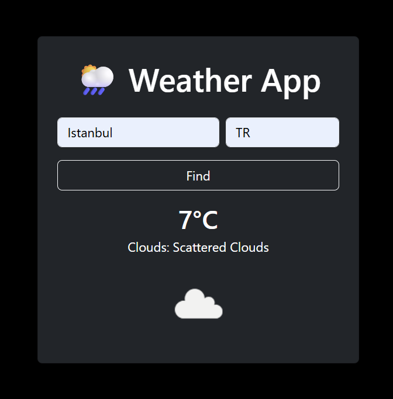

# Weather Dashboard — Flask 

A lightweight weather app (dashboard-style) built with Flask that allows users to search for real-time weather information by city and country code. The application integrates with the OpenWeatherMap API and focuses on clean request handling, error management, and a smooth user experience.

---

## Demo

---

## Key Features

- Search current weather by city and country code
- Real-time data fetched from OpenWeatherMap API
- Clear error handling for invalid input and API failures
- Prevents duplicate form submission on page refresh using Post/Redirect/Get (PRG)
- Environment-based configuration for sensitive data
- Responsive layout optimized for both desktop and mobile devices

---

## Tech Stack

- Backend: Python, Flask
- Frontend: HTML, Jinja2, Bootstrap
- API: OpenWeatherMap
- Environment Management: python-dotenv

---

## How It Works

1. User submits city and country code via a form.
2. The app validates input and requests geolocation data from the API.
3. Coordinates are used to fetch current weather data.
4. Results or error messages are stored temporarily using Flask sessions.
5. The app redirects to a GET request to safely render the result.
6. Session data is cleared after display to prevent repeated output on refresh.

---

## Installation & Setup

1. Clone the repository:
   git clone https://github.com/alphaRookie/weather-dashboard-flask.git
   cd weather-dashboard-flask

2. Create and activate a virtual environment:
   python -m venv venv
   venv\Scripts\activate

3. Install dependencies:
   pip install flask requests python-dotenv

4. Create a `.env` file in the project root:
   API_KEY=your_openweathermap_api_key
   SECRET_KEY=your_flask_secret_key

5. Run the application:
   python app.py

6. Open your browser and go to:
   http://127.0.0.1:5000
